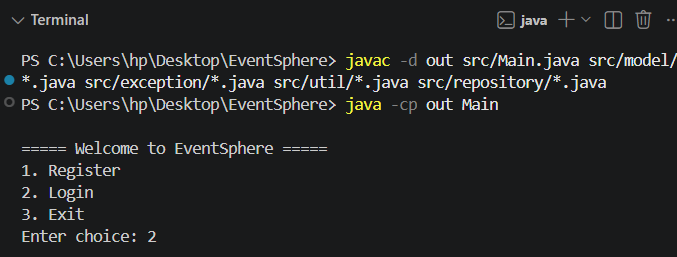
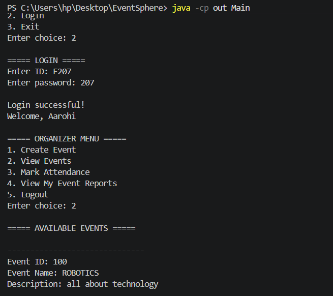
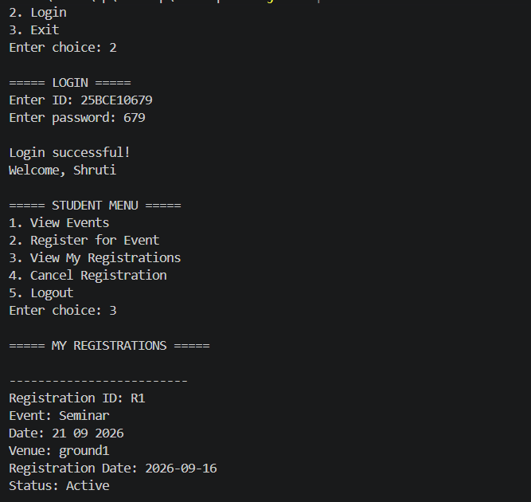
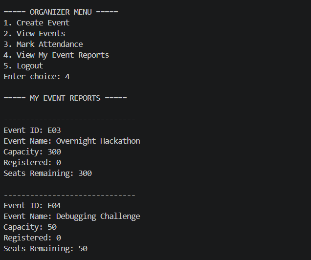

## EventSphere

## 1. College Event Management System

EventSphere is a Java-based command-line College Event Management System designed to manage college events, student registrations, attendance, and organizer reports.

The system supports two main roles:
- Student
- Organizer

The application uses file-based data persistence instead of a database, making it simple to run from the command line without requiring additional database setup.

## 2. Project Objectives

The main objectives of EventSphere are:
- Allow students to create accounts and log in.
- Allow organizers to create and manage college events.
- Allow students to view available events.
- Allow students to register for events.
- Prevent registration when an event is full.
- Allow students to view and cancel their registrations.
- Allow organizers to mark attendance.
- Allow organizers to view reports for their own events.
- Store application data using files.
- Maintain application activity through logging.
- Demonstrate Java OOP, data structures, validation, exception handling, and modular design.

## 3. Main Features

### Student Module

Students can:

1. Register an account.
2. Login.
3. View all available events.
4. Register for an event.
5. View their registrations.
6. Cancel a registration.
7. Logout.

### Organizer Module

Organizers can:

1. Register an account.
2. Login.
3. Create new events.
4. View events.
5. Mark attendance.
6. View reports for their own events.
7. Logout.

## 4. Event Management

Each event contains:

- Event ID
- Event Name
- Description
- Date
- Time
- Venue
- Capacity
- Organizer ID

The system automatically calculates:
Seats Remaining = Event Capacity - Active Registrations

Events are displayed with their current availability status:
AVAILABLE
LIMITED SEATS
EVENT FULL

Students cannot register for an event when no seats are available.

## 5. System Workflow

                    EventSphere
                       |
              -------------------
              |                 |
          Register             Login
                                |
                       ------------------
                       |                |
                    Student          Organizer
                       |                |
                ----------------    ----------------
                |      |      |    |      |       |
              View   Register Cancel Create Attendance
             Events   Event   Reg.  Event
                |                     |
              View                  Reports
           Registrations          My Events


## 6. Project Architecture

The project follows a modular structure with separate packages for models, repositories, utilities, and exceptions.

```text
EventSphere/
│
├── src/
│   ├── Main.java
│   │
│   ├── model/
│   │   ├── User.java
│   │   ├── Student.java
│   │   ├── Organizer.java
│   │   ├── Admin.java
│   │   ├── Event.java
│   │   ├── Registration.java
│   │   └── Attendance.java
│   │
│   ├── repository/
│   │   ├── UserRepository.java
│   │   ├── EventRepository.java
│   │   └── RegistrationRepository.java
│   │
│   ├── exception/
│   │   ├── EventFullException.java
│   │   ├── EventNotFoundException.java
│   │   └── DuplicateRegistrationException.java
│   │
│   └── util/
│       ├── InputValidator.java
│       ├── FileManager.java
│       └── Logger.java
│
├── data/
│   ├── users.txt
│   ├── events.txt
│   └── registrations.txt
│
├── logs/
│   └── application.log
│
├── screenshots/
│   ├── main-menu.png
│   ├── organizer-event.png
│   ├── student-registration.png
│   └── organizer-report.png
│
├── README.md
├── statement.md
└── .gitignore

## 7. Technologies Used

Programming Language: Java
Development Environment: Visual Studio Code
Version Control: Git
Repository Hosting: GitHub
Data Storage: Text files
Execution: Command Line / Terminal
No external database or JDBC connection is required.

## 8. Java Concepts Used

The project demonstrates important Object-Oriented Programming concepts.

OOP Concepts
Classes and Objects
Encapsulation
Inheritance
Abstraction
Polymorphism
Method Overriding
Constructors
super keyword
Inheritance Structure

## 9. Algorithms and Processing

The system uses basic algorithms for searching, filtering, registration processing, and seat calculation.

User Search
Users are searched using their unique ID.

Event Search
Events are searched using Event ID.

Registration Processing
Select Event
     |
Find Event
     |
Check Existing Registration
     |
Calculate Seats Remaining
     |
Event Full?
   /     \
 Yes      No
 |         |
Reject    Register
           |
       Save Data

## 10. File-Based Data Persistence

EventSync stores application data in text files.

users.txt : Stores registered user information.
events.txt : Stores created event information.
registrations.txt : Stores student registrations and their status.

The application loads existing data when it starts and saves updated data during operations. This allows important data to remain available after the application is closed.

## 11. Functional Requirements

Student :
Student registration, Student login, Event viewing, Event registration, Registration cancellation, Registration status viewing

Organizer :
Organizer registration, Organizer login, Event creation, Event viewing, Attendance management, Organizer-specific reports

## 12. Non-Functional Requirements

- Performance
The application uses in-memory ArrayList collections for managing currently loaded records.

- Security
Role-based access ensures that students and organizers receive different menus and operations.

- Usability
A simple numbered command-line interface makes the system easy to operate.

- Reliability
Input validation, duplicate checks, event capacity checks, and file persistence improve reliability.

- Maintainability
The application is divided into separate classes and packages, making the system easier to understand and modify.

- Error Handling
Invalid inputs and application-specific conditions are handled without unnecessarily terminating the program.

## 13. How to Run

You need:
- Java JDK
- Check Java installation: java -version
- Check Java compiler: javac -version

Step 1: Open the Project
        Open the EventSphere folder in Visual Studio Code.

Step 2: Compile
        Open the VS Code terminal and run:
        javac -d out src/Main.java src/model/*.java src/exception/*.java src/util/*.java src/repository/*.java

Step 3: Run
        java -cp out Main

## 14. Testing

The application can be tested through the command-line interface using the following test cases:

1. Register a new Student account and verify login.
2. Register a new Organizer account and verify login.
3. Login as an Organizer and create an event.
4. View the created event and verify its details and seat availability.
5. Login as a Student and register for the event.
6. Verify that the number of remaining seats decreases.
7. View the student's registrations.
8. Cancel the registration and verify that the registration status changes.
9. Verify that the available seats increase after cancellation.
10. Login as the Organizer and verify the event report.
11. Test invalid inputs such as empty values, invalid email, and invalid menu choices.
12. Restart the application and verify that saved users, events, and registrations are loaded correctly.
13. Check logs/application.log to verify that application activities are recorded.

## 15. Screenshots

### Main Menu



### Organizer Event Management



### Student Registration



### Organizer Report



## 16. Git Version Control

Git is used to maintain version control for the project.

git init
git add .
git commit -m "Initial EventSphere project"
git branch -M main
git remote add origin https://github.com/anshika25bai10981/EventSphere-.git
git push -u origin main

Git allows changes to the project to be tracked and maintained through a GitHub repository.

## 17. Future Enhancements

Possible future improvements include:
Database integration
Graphical user interface
Email notifications
QR-based attendance
Advanced event search and filtering
Password encryption
Detailed attendance reports

## 18. Conclusion

EventSphere is a Java-based College Event Management System that simplifies event creation, registration, cancellation, attendance, and reporting for students and organizers,  while providing a simple and maintainable command-line application.
The project demonstrates practical use of OOP concepts, data structures, file handling, validation, exception handling, logging, modular architecture, and Git version control.

The system is designed to be easy to execute, understand, maintain, and extend.
